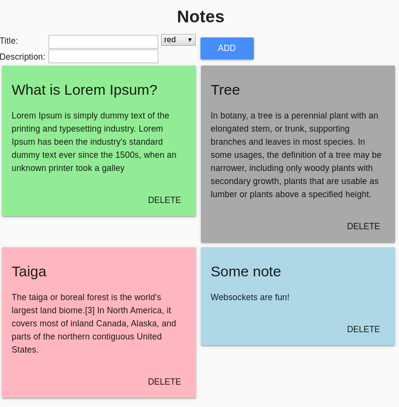
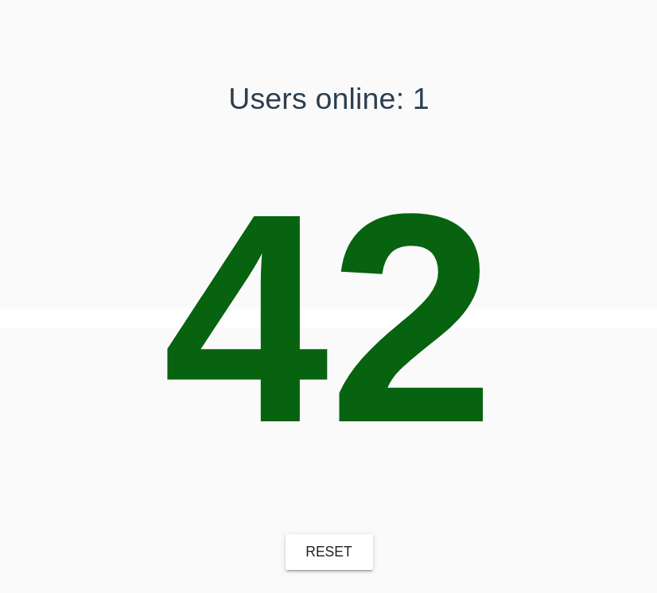

# weeapps

Little django application to play around with websockets and django channels

See the individual `README.md` files for usage and install instructions

## quick test run

This will build and run, frontend and backend.

```sh
docker-compose up --build
```

## example images



